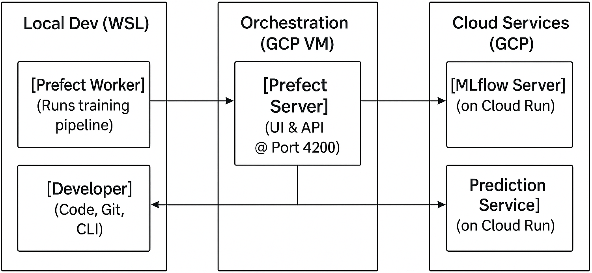
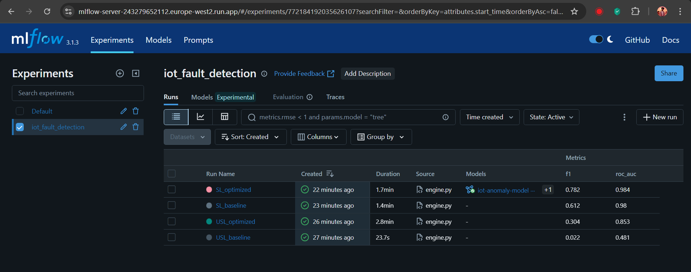

# MLOps Pipeline for IoT Anomaly Detection

This repository contains the code and infrastructure for a complete MLOps project, developed as a capstone for the [DataTalksClub MLOps Zoomcamp](https://github.com/DataTalksClub/mlops-zoomcamp). The project automates the training, deployment, tracking, and monitoring of a machine learning model designed to detect anomalies in sensor data from IoT devices.

## Table of Contents
* [Problem Statement](#-problem-statement)
* [Project Architecture](#-project-architecture)
* [Key MLOps Features](#-key-mlops-features)
* [Tech Stack](#-tech-stack)
* [Repository Structure](#-repository-structure)
* [Setup Guide](#-setup-guide)
* [Workflow](#-workflow)
* [Code Quality & Testing](#-code-quality--testing)
* [Model Monitoring](#-model-monitoring)
* [Future Work](#-future-work)
* [Data Source & Acknowledgements](#-data-source--acknowledgements)

## Problem Statement

In the world of IoT, fleets of devices constantly stream telemetry data. Ensuring the quality and reliability of this data is crucial for analytics and operations. Malfunctioning sensors can produce anomalous readings, leading to incorrect insights and poor business decisions. This project aims to build an automated system that can:
1.  Train a model to distinguish between normal and anomalous sensor readings.
2.  Deploy this model as a real-time prediction service.
3.  Track all experiments and manage model versions in a central registry.
4.  Orchestrate the entire workflow in a repeatable and observable manner.
5.  Monitor the deployed model for performance degradation or data drift.

## Project Architecture
The system is composed of several decoupled services, primarily hosted on Google Cloud Platform (GCP) and orchestrated by a self-hosted Prefect server.




* **Orchestration Server (Prefect):** A self-hosted Prefect server runs in a Docker container on a persistent **Google Compute Engine (GCE)** VM. This provides the UI and backend for managing and observing all pipelines.
* **Execution Worker (Prefect):** A Prefect worker runs in the local development environment (WSL) to execute the training pipelines.
* **Experiment Tracking (MLflow):** An MLflow server is deployed as a serverless application on **GCP Cloud Run**. It uses a **Cloud SQL (PostgreSQL)** instance for metadata and a **Google Cloud Storage (GCS)** bucket for artifacts, providing a persistent and scalable backend for the Model Registry and experiment logs.
* **Model Serving (Prediction Service):** The final trained model is served via a REST API deployed as a separate serverless application on **GCP Cloud Run**.
* **CI/CD (GitHub Actions):** The entire process of building the application's Docker image and deploying the MLflow and prediction services to GCP is automated using GitHub Actions.
* **Infrastructure as Code (Terraform):** All required GCP resources (Cloud SQL, GCS, Artifact Registry, GCE VM, etc.) are defined and provisioned using Terraform.

---

## Key MLOps Features

This project implements a wide range of MLOps best practices:
* Infrastructure as Code (IaC)
* CI/CD Automation
* Experiment Tracking
* Model Registry
* Workflow Orchestration
* Model Serving (as a REST API)
* Model Monitoring
* Code Quality & Testing (Linting, Formatting, Pre-commit Hooks, Integration Tests)

## Tech Stack

* **Cloud Provider:** Google Cloud Platform (GCP)
* **Workflow Orchestration:** Prefect
* **Experiment Tracking:** MLflow
* **Infrastructure as Code:** Terraform
* **CI/CD:** GitHub Actions
* **Model Serving:** Flask & Gunicorn on GCP Cloud Run
* **Containerization:** Docker
* **Development Environment:** Python, Poetry, WSL

## Repository Structure


---
### 1. Model Prototyping (Paperspace Gradient)
Initial model development, including training a TensorFlow-based autoencoder, was performed on a **Paperspace Gradient Notebook** with GPU support. The `setup.sh` script is tailored to this ephemeral environment. Due to platform limitations (e.g., prohibitions on tunneling tools), the final orchestration and serving components were moved to a more stable, self-hosted architecture.

### 2. Prerequisites
* A Google Cloud Platform (GCP) account with billing enabled.
* A local Linux environment (like WSL on Windows).
* Terraform and `gcloud` CLI installed.
* A GitHub account with a Personal Access Token (PAT).

### 3. Infrastructure Setup

#### **GCP Infrastructure (Terraform)**
1.  Navigate to the `infra/` directory.
2.  Create a `terraform.tfvars` file and provide your `project_id`, `region`, and a secure `db_password`.
3.  Add `terraform.tfvars` to your `.gitignore` file.
4.  Run `terraform init` and `terraform apply`. This will provision the GCS bucket, Cloud SQL instance, GCE VM for Prefect, and all necessary permissions.
5.  Note the outputs, especially the `gce_vm_external_ip`.

### 4. Application Deployment & Setup

#### **GitHub Secrets**
1. In your GitHub repository settings, add the following secrets:
* `GCP_PROJECT`: Your GCP project ID.
* `GCP_SA_KEY`: The JSON key for your GCP service account.
* `DB_PASSWORD`: The password for the `mlflow_user` you set in `terraform.tfvars`..
* `MLFLOW_PASSWORD`: Password for the MLflow UI basic auth.
2. Pushing a change to the `src` directory, `Dockerfile`, `deploy.yml`, or `requirements.txt` on the `main` branch will trigger the workflow to build and deploy your services to Cloud Run.


### 5. Local Environment Setup (WSL)
This setup is for the machine that will run the Prefect worker.
1.  Clone this repository to your local machine (WSL).
2.  Create a `.env` file for your secret environment variables (e.g., MLflow password).
3.  Run the setup script: `sudo ./set_wsl.sh`. This will install all necessary system tools (like `gcloud`, `poetry`) and Python dependencies.
4.  Authenticate with Google Cloud: `gcloud auth application-default login`.
5.  Connect your local Prefect CLI to your GCE server:
    ```bash
    prefect profile create gce
    prefect config set PREFECT_API_URL="http://[YOUR_GCE_VM_IP]:4200/api"
    prefect profile use gce
    prefect work-pool create 'mlops-pool' --type process
    ```

---
## Workflow

1.  **Start Your Worker (Terminal 1):** Activate your environment, set your cloud credentials, and start the worker. It must be left running to execute pipelines.
    ```bash
    source "$(poetry env info --path)/bin/activate"
    source .env
    prefect worker start --pool 'mlops-pool'
    ```

2.  **Terminal 2 (Commands):** Use this terminal to manage and run your pipelines.
    ```bash
    # Create/update the deployment on your server
    python prefect_deploy.py

    # Trigger a run
    prefect deployment run 'iot-training-pipeline/IoT Training'
    ```

3.  **Observe:**
    * Watch the run in your **Prefect UI** at `http://[YOUR_GCE_VM_IP]:4200`.
    * View the results in your **MLflow UI** at its GCP Cloud Run URL.




---
## Code Quality & Testing

This project uses standard tools to maintain high code quality.

* **Formatter:** `black`
* **Linter:** `ruff`
* **Makefile:** Provides shortcuts for common tasks. Run `make format` and `make lint`.
* **Pre-commit Hooks:** Automatically formats and lints code before every commit. Install with
`poetry run pre-commit install` or
`pre-commit install` from poetry environment.
* **Integration Test:** To test the live prediction endpoint, set the service URL and run pytest:
    ```bash
    export SERVICE_URL="[https://your-prediction-service-url.run.app](https://your-prediction-service-url.run.app)"
    make test
    ```

## Model Monitoring


1.  The live prediction service logs all incoming requests to a `prediction_logs/` folder in the GCS bucket.
2.  A separate Prefect flow, `src/iot_anomaly/monitoring.py`, is deployed and scheduled to run daily at 6am.
3.  This flow calculates the [Kolmogorov-Smirnov](https://en.wikipedia.org/wiki/Kolmogorov%E2%80%93Smirnov_test) statistic for key features to detect drift and logs the results back to a dedicated `model_monitoring` experiment in MLflow.

## Future Work

* Implement a more comprehensive monitoring stack with **Evidently AI, Prometheus, and Grafana** for detailed dashboards and alerting.
* Automate the retraining pipeline by having the monitoring flow conditionally trigger the training flow if drift is detected.

## Data Source & Acknowledgements

* This project is the capstone for the **DataTalksClub MLOps Zoomcamp**.
* The dataset used is the [Environmental Sensor Telemetry Data](https://www.kaggle.com/datasets/garystafford/environmental-sensor-data-132k/data), created by Gary A. Stafford and available on Kaggle.
